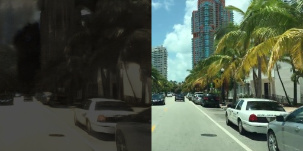
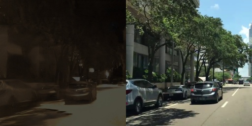
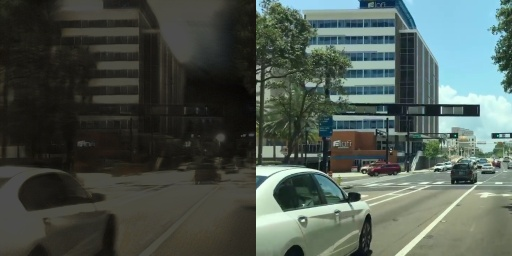

## Note
We are unable to share our training details as our paper is still being reviewed. Once our paper is published, we will publish all of our codes. However, we have shared our dataset and Pytorch implementation of the generator and the discriminator. If anyone is interested, we will share the weights for the generator and the discriminator. 

## Dataset
Training dataset used in this experiment is a set of pixel-to-pixel paired night-day images. 
Sample images form training dataset is given below.

Right image is the day-time image & left image is the corresponding pixel-to-pixel paired night-time image. The day-time images are composed of images from the [Oxford RobotCar dataset](https://robotcar-dataset.robots.ox.ac.uk/datasets/), the [ZJU dataset](https://github.com/elnino9ykl/ZJU-Dataset) and images collected form driving Downtown videos shared by [J Utah](https://www.youtube.com/channel/UCBcVQr-07MH-p9e2kRTdB3A). The corresponding pixel-to-pixel paired night-time images were synthesized using the day-to-night image transformation technique proposed by [ToDayGAN](https://github.com/AAnoosheh/ToDayGAN).

Disclaimer: Please note no copyright infrignement is intended, and I do not own nor claim to own any of the video shared by [J Utah](https://www.youtube.com/channel/UCBcVQr-07MH-p9e2kRTdB3A)

The dataset used for this experiment can be found in [this link](https://drive.google.com/file/d/1aiabbt-PsIplHEvNd48qz4E5GqSRPH9k/view?usp=sharing)
